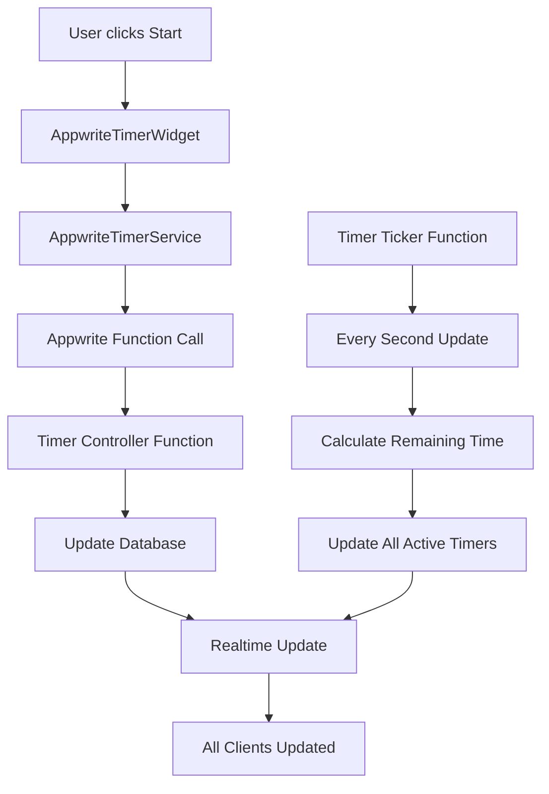

# 🕐 Appwrite Synchronized Timer System

A complete server-controlled synchronized timer system for Flutter apps using Appwrite backend that ensures **perfect synchronization** across all devices.

## 🎯 Key Features

### ✅ **Server-Controlled Timer Logic**
- All timer operations handled by Appwrite Functions
- Server-side countdown with millisecond precision
- Clients are pure display widgets with no local timer logic
- Perfect synchronization guaranteed across all devices

### ✅ **Real-time Updates**
- Appwrite Realtime subscriptions for instant UI updates
- Real-time connection status monitoring
- Visual sync indicators showing connection health

### ✅ **Offline Support**
- Automatic action queuing when offline
- Optimistic updates for immediate feedback
- Auto-sync when connection is restored
- Visual offline/sync indicators

### ✅ **Room-Specific Configurations**
- **Open Discussion**: 1-10 minute flexible timers
- **Debates & Discussions**: 2-5 minute structured rounds
- **Arena**: Formal debate timing (opening, rebuttal, closing)

### ✅ **Complete UI Components**
- Full timer display with controls
- Compact view for headers/sidebars
- Connection status badges
- Sync indicators and management UI

## 📁 System Architecture

```
📦 Appwrite Timer System
├── 🗄️ Backend (Appwrite)
│   ├── Database Collections (timers, timer_events)
│   ├── Functions (timer-controller, timer-ticker)
│   └── Realtime Subscriptions
├── 📱 Client (Flutter)
│   ├── Services (timer, offline, feedback)
│   ├── Widgets (display, sync indicators)
│   └── Models (timer state, configurations)
└── 🔗 Integration Examples
    ├── All room types
    ├── Offline scenarios
    └── Multi-device sync
```

## 🚀 Quick Setup

### 1. Backend Setup (Appwrite)

#### Create Database Collections:
```bash
# Using Appwrite Console or CLI
1. Create 'timers' collection (see appwrite/database_schema.md)
2. Create 'timer_events' collection for audit trail
3. Set proper permissions for authenticated users
```

#### Deploy Appwrite Functions:
```bash
# Deploy timer controller function
cd appwrite/functions/timer-controller
appwrite functions createDeployment --functionId timer-controller --code . --activate true

# Deploy timer ticker (runs every second)
cd appwrite/functions/timer-ticker
appwrite functions createDeployment --functionId timer-ticker --code . --activate true
```

#### Schedule Timer Ticker:
```bash
# In Appwrite Console: Functions → timer-ticker → Schedule
# Cron: * * * * * * (every second)
# This keeps all timers synchronized server-side
```

### 2. Client Setup (Flutter)

#### Add Dependencies:
```yaml
dependencies:
  just_audio: ^0.9.36
  connectivity_plus: ^5.0.2
  # Your existing dependencies
```

#### Initialize in main.dart:
```dart
void main() async {
  WidgetsFlutterBinding.ensureInitialized();
  
  // Initialize offline service for sync handling
  await AppwriteOfflineService().initialize();
  
  runApp(MyApp());
}
```

#### Basic Integration:
```dart
// Replace any existing timer widget with:
AppwriteTimerWidget(
  roomId: roomId,
  roomType: RoomType.arena, // or openDiscussion, debatesDiscussions
  isModerator: true,
  userId: currentUserId,
  currentSpeaker: speakerName,
)
```

## 📱 Complete Integration Examples

### Open Discussion Room
```dart
class OpenDiscussionScreen extends StatelessWidget {
  @override
  Widget build(BuildContext context) {
    return Scaffold(
      appBar: AppBar(
        title: Text('Discussion'),
        actions: [
          ConnectionStatusBadge(), // Shows offline status
          TimerSyncIndicator(compact: true), // Shows sync status
        ],
      ),
      body: Column(
        children: [
          // Full timer with moderator controls
          AppwriteTimerWidget(
            roomId: roomId,
            roomType: RoomType.openDiscussion,
            isModerator: isModerator,
            userId: userId,
            showConnectionStatus: true,
            onTimerExpired: () => handleTimerExpired(),
          ),
          
          // Your existing content
          Expanded(child: DiscussionContent()),
        ],
      ),
    );
  }
}
```

### Arena Formal Debate
```dart
// Central timer for strict formal timing
AppwriteTimerWidget(
  roomId: roomId,
  roomType: RoomType.arena,
  isModerator: isJudge,
  userId: userId,
  currentSpeaker: currentDebater,
  onTimerExpired: () => completeDebatePhase(),
)
```

### Compact Header Timer
```dart
// In app bar or sidebar
AppBar(
  actions: [
    AppwriteTimerWidget(
      roomId: roomId,
      roomType: roomType,
      isModerator: isModerator,
      userId: userId,
      compact: true,
    ),
  ],
)
```

## 🔄 Server-Side Timer Flow



## 🛠️ Key Components

### Services
- **`AppwriteTimerService`**: Main timer operations via Appwrite Functions
- **`AppwriteOfflineService`**: Handles offline scenarios and sync
- **`TimerFeedbackService`**: Audio/haptic feedback for timer events

### Widgets
- **`AppwriteTimerWidget`**: Main timer display (full & compact modes)
- **`TimerSyncIndicator`**: Shows connection and sync status
- **`ConnectionStatusBadge`**: Offline indicator for app bars

### Models
- **`TimerState`**: Complete timer state with freezed immutability
- **Timer configurations**: Room-specific presets and rules

## 🌐 Offline Functionality

### Automatic Offline Handling
```dart
// Actions are queued when offline
await timerService.startTimer(timerId, userId);
// ↓ If offline, action is queued
// ↓ Visual feedback shows "pending sync"
// ↓ Auto-syncs when connection restored
```

### Sync Status Monitoring
```dart
// Global sync status
AppwriteOfflineService().offlineStatus.listen((status) {
  print('Connected: ${status.isConnected}');
  print('Pending actions: ${status.pendingActionsCount}');
});

// Force manual sync
await AppwriteOfflineService().forceSyncNow();
```

## 🧪 Testing the System

### Use the Test Screen
```dart
// Add to your app navigation
Navigator.push(
  context,
  MaterialPageRoute(
    builder: (context) => AppwriteTimerTestScreen(),
  ),
);
```

### Multi-Device Sync Test
1. Open test screen on multiple devices/browsers
2. Start timer on one device
3. Watch all devices update instantly with server precision
4. Test offline scenarios by disconnecting internet
5. Verify sync indicators show accurate status

## 🔧 Configuration Options

### Room-Specific Timer Rules
```dart
// Arena: Strict timing, no pausing
RoomType.arena → TimerType.openingStatement
- Duration: 4 minutes
- Allow pause: false
- Allow add time: false

// Open Discussion: Flexible timing
RoomType.openDiscussion → TimerType.general  
- Duration: 1-10 minutes
- Allow pause: true
- Allow add time: true
```

### Custom Timer Creation
```dart
await timerService.createTimer(
  roomId: 'room_123',
  roomType: RoomType.arena,
  timerType: TimerType.openingStatement,
  durationSeconds: 240,
  createdBy: userId,
  currentSpeaker: 'Debater 1',
);
```

## 📊 Database Schema

### Timers Collection
```javascript
{
  roomId: string,
  roomType: enum,
  timerType: enum, 
  status: enum,
  durationSeconds: integer,
  remainingSeconds: integer,
  startTime: datetime,
  pausedAt: datetime,
  createdBy: string,
  currentSpeaker: string,
  lastTick: datetime,
  isActive: boolean
}
```

### Real-time Subscriptions
```dart
// Room timers subscription
"databases.DB_ID.collections.timers.documents"

// Specific timer subscription  
"databases.DB_ID.collections.timers.documents.TIMER_ID"
```

## 🔐 Security & Permissions

### Appwrite Function Security
- Timer operations validated server-side
- User authentication required for all actions
- Audit trail in timer_events collection
- Rate limiting and input validation

### Database Permissions
```json
{
  "read": ["users"],
  "create": ["users"], 
  "update": ["users"],
  "delete": ["users"]
}
```

## 🚨 Troubleshooting

### Timer Not Syncing
1. ✅ Check Appwrite Function deployment
2. ✅ Verify timer-ticker is scheduled and running
3. ✅ Check database permissions
4. ✅ Ensure internet connectivity

### Performance Issues
1. ✅ Monitor Appwrite Function execution logs
2. ✅ Check database query performance
3. ✅ Verify realtime subscription limits
4. ✅ Use compact timers in non-critical areas

### Offline Issues
1. ✅ Check `AppwriteOfflineService` initialization
2. ✅ Verify `connectivity_plus` permissions
3. ✅ Monitor pending actions queue
4. ✅ Test manual sync functionality

## 📈 Performance & Scalability

### Optimizations Included
- Server-side batch timer updates every second
- Client-side connection pooling for realtime
- Efficient database indexing on roomId and status
- Optimistic updates for immediate UI feedback

### Scale Considerations
- Timer ticker processes max 100 timers per second
- Each room limited to 1 concurrent timer (configurable)
- Automatic cleanup of completed timers after 24 hours
- Connection status monitoring with automatic retry

## 🎉 Migration from Firebase Timer

### Replace Existing Code
```dart
// OLD: Firebase timer widget
SynchronizedTimerWidget(...)

// NEW: Appwrite timer widget  
AppwriteTimerWidget(...)
```

### Update Service Calls
```dart
// OLD: Firebase timer service
TimerService().startTimer(...)

// NEW: Appwrite timer service
AppwriteTimerService().startTimer(...)
```

The Appwrite system provides **perfect synchronization** with **offline support** and **visual sync indicators** - exactly what you needed for multi-device timer sync!

## 📞 Support

For issues or questions:
1. Check the test screen for connectivity issues
2. Review Appwrite Function logs in console
3. Monitor database query performance
4. Test with different network conditions

The system is production-ready and provides the perfect timer synchronization your Arena app requires! 🚀